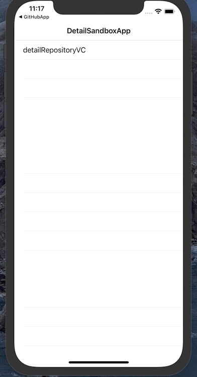
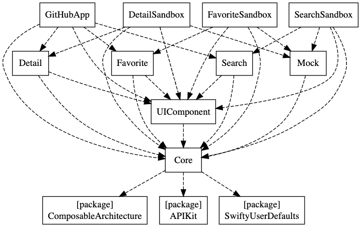

# swift-composable-architecture-example
This project is swift-composable-architecture example

## Envionment
- Xcode12
- Swift5.3
- SwiftPackageManager
- Mint

## GIF
### GitHubApp
|GitHubApp|DetailSandbox|
|:-:|:-:|
||

## Module

### Graphviz


### App
- GitHub Search App
- Local favorite function (UserDefaluts)
- Resolve dependencies

### Feature Layer
#### Detail
- Detail Repository function
- Toggle favorite status

#### Search
- Search function
- Show Detail Repository 

#### Favorite
- Favorite function
- Show Detail Repository 

### Other Layer
#### UIComponent
- View
- Color
- Font

#### Core
- Protocol
- Extension
- Request
- Entity
- Text(SwiftGen)
- Resource(SwiftGen)

### Sandbox
#### DetailSandbox
- Sandbox App that can check deitalRepositoryVC
#### SearchSandbox
- Sandbox App that can check searchView
#### FavoriteSandbox
- Sandbox App that can check favoriteView

## Getting Started
1. Open `GitHubApp.xcodeproj`
2. Set GitHub token
```swift
extension Request {
    public var baseURL: URL { URL(string: "https://api.github.com")! }

    // set github token
    public var headerFields: [String: String] {
        ["Authorization": "token $GITHUB_TOKEN"]
    }
}
```
